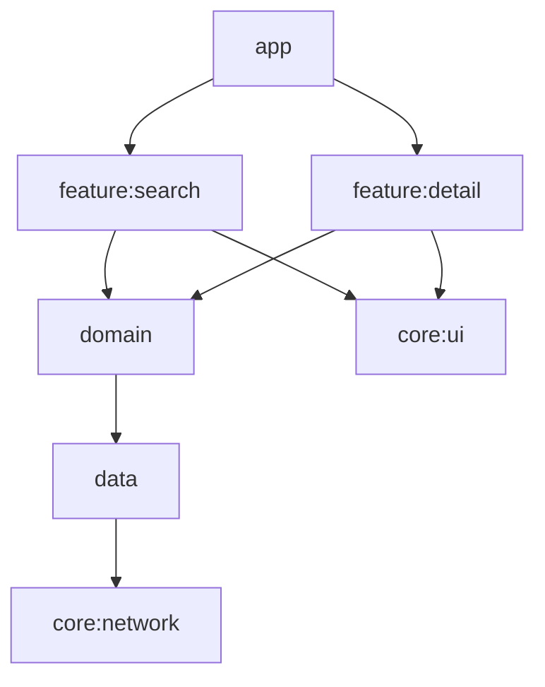
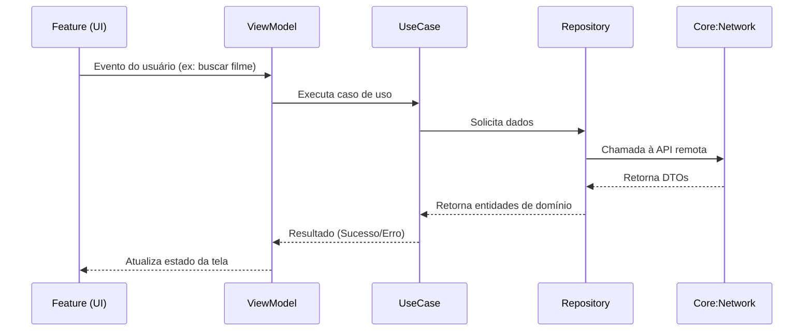

# PartiuVer — Descrição e Arquitetura do Aplicativo

## 🎬 Funcionalidades do Aplicativo

O **PartiuVer** é um aplicativo Android que ajuda você a **descobrir onde assistir seus filmes favoritos** de forma simples e prática.  

- **🔍 Busca de filmes:** digite o nome de um filme e veja instantaneamente uma lista com os títulos correspondentes, acompanhados de imagem, duração e avaliação (Tomato Meter).  
- **📖 Detalhes completos:** ao selecionar um filme, o aplicativo exibe informações como título, duração e nota, além de uma seção dedicada a **“Onde Assistir”**.  
- **🎥 Plataformas de streaming:** o app mostra em quais serviços o filme está disponível (como Disney Plus, Netflix, Paramount+ etc.) e o tipo de exibição (HD, 4K).  
- **➡️ Acesso direto:** tocando em **“Conferir”**, o usuário é redirecionado para o aplicativo ou site de streaming correspondente, facilitando o acesso imediato ao conteúdo.  
- **✨ Experiência fluida:** a interface é moderna, leve e intuitiva — ideal para quem quer encontrar rapidamente um filme e assistir sem complicações.  

O **PartiuVer** combina praticidade e clareza para oferecer uma experiência simples de **busca e descoberta de filmes**, conectando você diretamente ao streaming onde ele está disponível.

---

# Arquitetura do Aplicativo — PartiuVer Android

O **PartiuVer** foi desenvolvido seguindo princípios de **Clean Architecture** e **modularização** para garantir **separação de responsabilidades**, **facilidade de manutenção**, **testabilidade** e **evolução escalável**.  
A estrutura do projeto é composta por módulos independentes que refletem as camadas da arquitetura e os contextos de negócio do aplicativo.

---

## 1. Visão Geral da Arquitetura

A arquitetura do **PartiuVer** é baseada em **camadas limpas (Clean Architecture)** e organizada em **módulos Gradle**.  
Cada camada possui um papel específico e depende apenas de camadas mais internas, garantindo **baixo acoplamento** e **alta coesão**.

### Estrutura em alto nível

```
app
├── core:network
├── core:ui
├── domain
├── data
├── feature:search
└── feature:detail
```

### Diagrama visual das dependências



O diagrama acima ilustra o fluxo de dependências **de fora para dentro**, onde cada módulo conhece apenas o necessário da camada imediatamente abaixo.

---

## 2. Princípios Fundamentais

- **Clean Architecture** — separa claramente UI, domínio e dados.
- **MVVM (Model-View-ViewModel)** — adotado nas camadas de apresentação.
- **Modularização** — cada responsabilidade em seu próprio módulo, com fronteiras bem definidas.
- **Independência de frameworks** — o domínio é totalmente desacoplado do Android e de bibliotecas externas.
- **Testabilidade** — cada camada pode ser testada isoladamente.
- **Reuso** — componentes genéricos em `core:*` podem ser utilizados em várias features.

---

## 3. Camadas e Módulos

### 🏁 `app` — Módulo de Entrada

O módulo **app** é o ponto de entrada da aplicação Android.  
Ele **orquestra a inicialização**, configura temas e navegação e conecta todas as dependências.

**Responsabilidades:**
- Inicialização do aplicativo e composição de módulos.
- Definição do tema global e `NavHost`.
- Integração das features (`search`, `detail`) no fluxo principal.

**Não contém:** lógica de negócio, código de rede ou manipulação de dados.

---

### 🌐 `core:network` — Infraestrutura de Rede

O módulo **core:network** concentra tudo relacionado à **comunicação com APIs**.  
Ele fornece clientes HTTP, interceptadores, tratadores de erro e conversores genéricos.

**Responsabilidades:**
- Configuração centralizada da camada de rede (ex.: Retrofit, OkHttp ou Ktor).
- Tratamento de erros e exceções de transporte.
- Fornecimento de clientes para os repositórios do módulo `data`.

**Objetivo:** manter a rede desacoplada do domínio e das features.

---

### 🎨 `core:ui` — Componentes de Interface Compartilhados

O módulo **core:ui** define o **design system** do app.  
Inclui temas, estilos e componentes visuais reutilizáveis (como botões, barras de título e placeholders de erro).

**Responsabilidades:**
- Padronizar a identidade visual do app.
- Facilitar o reuso de componentes visuais entre features.
- Manter consistência e acessibilidade.

**Não contém:** lógica de negócio ou controle de fluxo.

---

### 🧠 `domain` — Regras de Negócio

O módulo **domain** é o **núcleo da aplicação**.  
Ele define as **entidades**, **casos de uso (Use Cases)** e **interfaces de repositório** que expressam o comportamento essencial do sistema.

**Responsabilidades:**
- Conter toda a lógica de negócio pura.
- Definir modelos imutáveis (entidades) e regras de transformação.
- Definir interfaces para o acesso a dados (`MovieRepository`, por exemplo).

**Características:**
- Não depende de Android nem de bibliotecas externas.
- Testável isoladamente.
- O domínio “não sabe” de onde vêm os dados (rede, cache, etc.).

---

### 💾 `data` — Implementação de Acesso a Dados

O módulo **data** implementa os **repositórios e fontes de dados** definidos no domínio.  
É responsável por **buscar, transformar e fornecer dados** ao domínio, conectando-se às camadas de rede ou armazenamento.

**Responsabilidades:**
- Implementar as interfaces do domínio (ex.: `MovieRepositoryImpl`).
- Consumir APIs remotas via `core:network`.
- Converter modelos remotos (DTOs) em entidades de domínio.
- Tratar exceções e normalizar erros.

**Objetivo:** isolar toda a complexidade de dados e permitir troca de fontes (API, cache, banco local) sem impacto no domínio.

---

### 🔍 `feature:search` — Funcionalidade de Busca

O módulo **feature:search** implementa a tela e a lógica de busca de filmes.  
Aplica o padrão **MVVM**: a UI observa o estado da `ViewModel`, que consome casos de uso do `domain`.

**Responsabilidades:**
- Gerenciar o ciclo de vida da busca (query, carregamento, resultado, erro).
- Exibir listas de filmes e lidar com interações do usuário.
- Navegar para a tela de detalhes ao selecionar um item.

**Depende de:** `domain` (para casos de uso) e `core:ui` (para componentes visuais).

---

### 🎬 `feature:detail` — Funcionalidade de Detalhes

O módulo **feature:detail** é responsável pela exibição das informações detalhadas de um filme selecionado.

**Responsabilidades:**
- Carregar e apresentar informações de um filme (sinopse, elenco, etc.).
- Exibir estados de carregamento e erro.
- Integrar-se com o caso de uso de obtenção de detalhes.

**Depende de:** `domain` e `core:ui`.

---

## 4. Comunicação entre Camadas

A comunicação entre os módulos segue **fluxos unidirecionais**, garantindo isolamento e clareza.



---

## 5. Benefícios da Arquitetura

- **Evolutiva:** adicionar novas features sem impacto nas existentes.
- **Escalável:** cada módulo compila e testa isoladamente.
- **Testável:** lógica de negócio pura no domínio, sem dependência de framework.
- **Reutilizável:** componentes visuais e utilitários centralizados em `core`.
- **Resiliente:** desacoplamento entre camadas permite trocar tecnologias (ex.: Retrofit → Ktor) sem grandes refatores.

---

## 6. Conclusão

A arquitetura do **PartiuVer Android** foi projetada para oferecer **clareza, modularidade e extensibilidade**.  
Cada módulo cumpre um papel bem definido dentro da Clean Architecture, permitindo que o aplicativo evolua de forma segura, organizada e sustentável.
